+++
title = 'KiCad+FlatCAM+Kitmillで切削基板を作る'
date = 2024-07-16T03:06:37+09:00
draft = false
+++
通常，Kitmillを使うとしたらORIMIN PCBを使うのが一般的だと思います．しかしながらあのソフトウェアはX2拡張に非対応であるため(具体的には円弧なドが使えない)KiCadとは相性が悪いです．そのためフリーのOSSなCAMであるFlatCAMを使ってガーバーデータからG-codeを生成しようと思います．

## ガーバーデータの用意
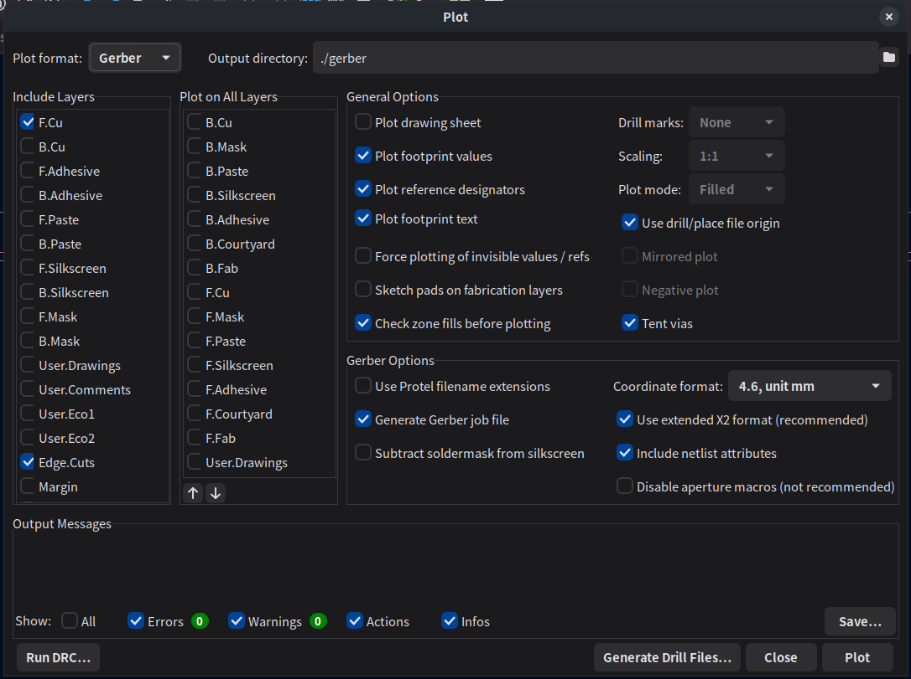
ドリルデータはPTHとNPTHを纏めておく\
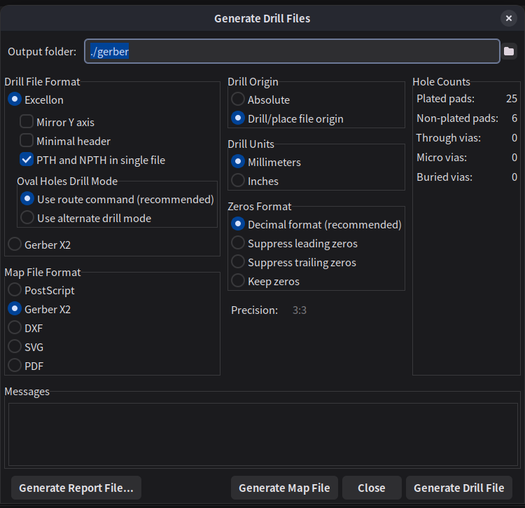

## CAM(FlatCAM)で変換
切削，穴開け，外形加工にはORIGINAL MIND社の土佐昌典VC(ツール径4 mm,ドリル径0.5 mm, 先端角53.14 deg(切り込み深さ=切削幅))を使用\
デザインルールよりパターンのクリアランス(切削幅)は0.2 mm，送り速度はガラエポなのでチキって100mm/s．\
ヘリカル加工，外形加工時の切り込み深さは0.2 mm，基板厚は1.6なのでz=-1.7 mmまで切る．送り速度は60 mm/s\

- Cu.gbr
- Edge.gbr\
"File" → "Open Gerber"
- .drl\
"File" → "Open Excellon"

読み込んだ後
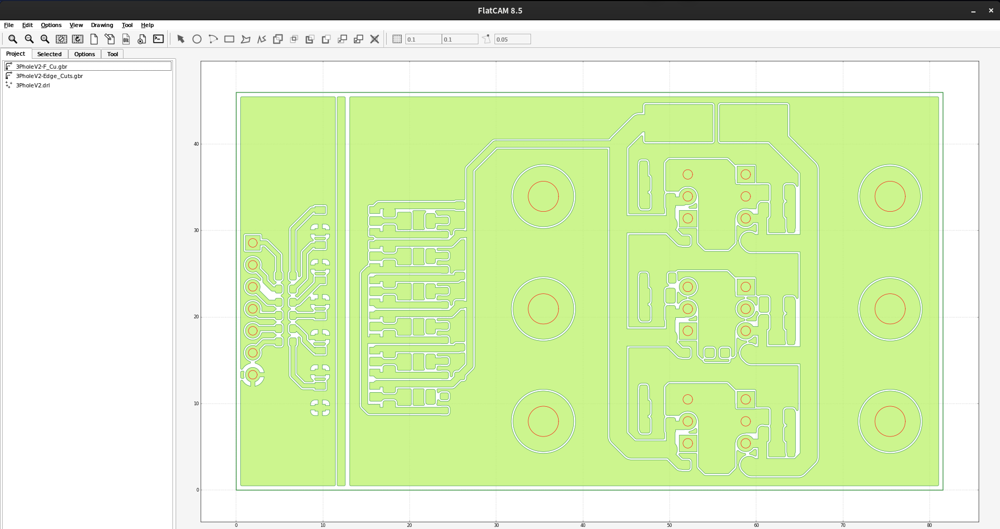

### パターン
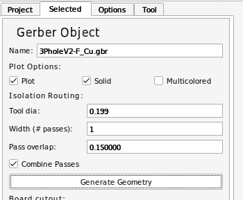
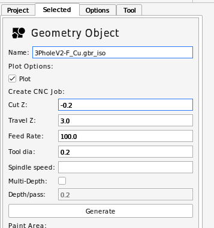

### 外形
外形はパターンのBoard cutoutでもできますが，任意の形に切ろうとした場合はこの方法が必須です．\
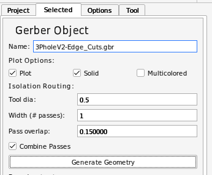\
このままではEdgeの線の内外に切削パスが通ってしまうため\
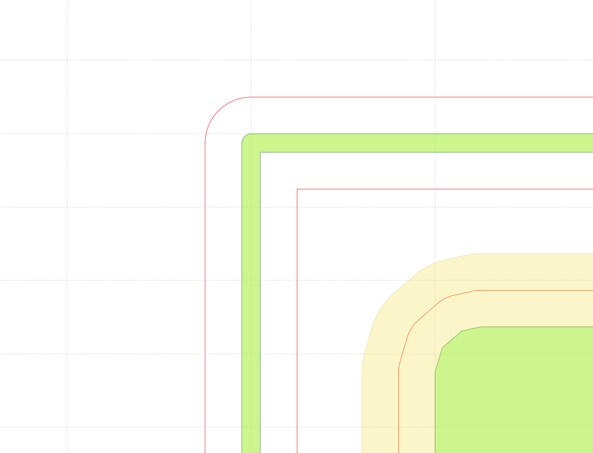
EdgeのGeometryを選択した状態で\
"Edit" → "Edit Geometry"\
内側の赤線を選択\
上タブ"Cut Path"\
内側の赤線を選択\
上タブ"Delete Shape"\
"Edit" → "Update Geometry"\

とすることで外側だけ彫るパスが生成できる．\
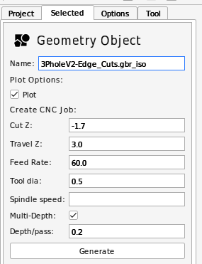
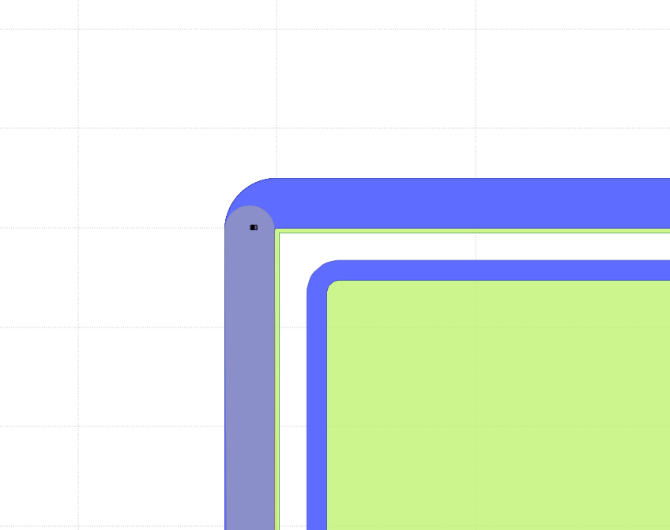

### 穴開け(ドリル)
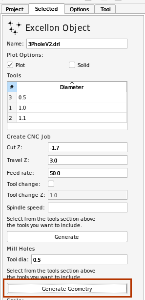\
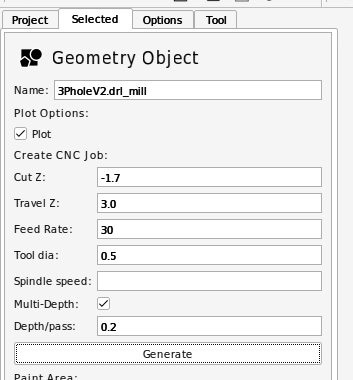

## 変換結果
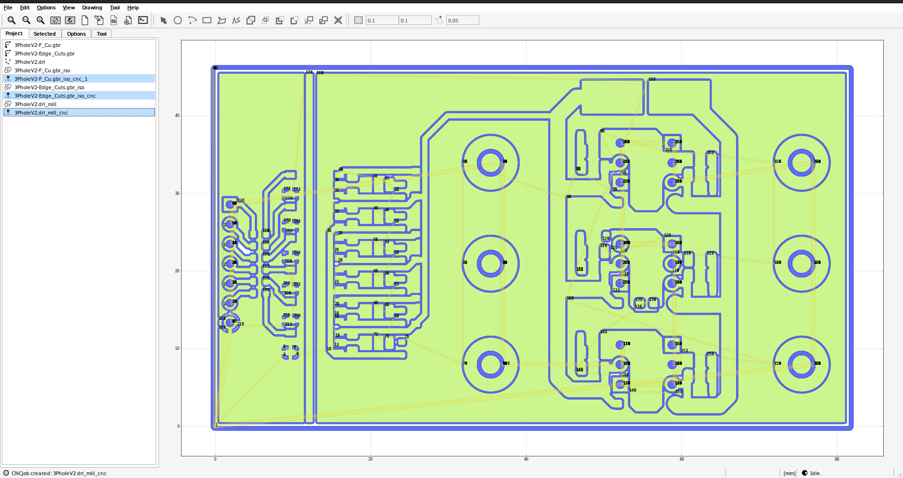\
ここで青色の線(切り込む位置)がパターンに沿っていて抜けのないことを確認．\
線幅とドリル径が等しいと通ってくれないことがある．そういうときはGeometryを生成する段階でツール系を0.01 mm程度小さくすることで解決可能．\
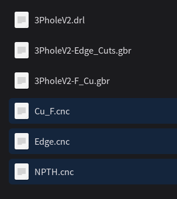\
このデータをUSBCNCにて\
パターン→穴開け→外形\
の順に切削を行うことで切削が可能である．