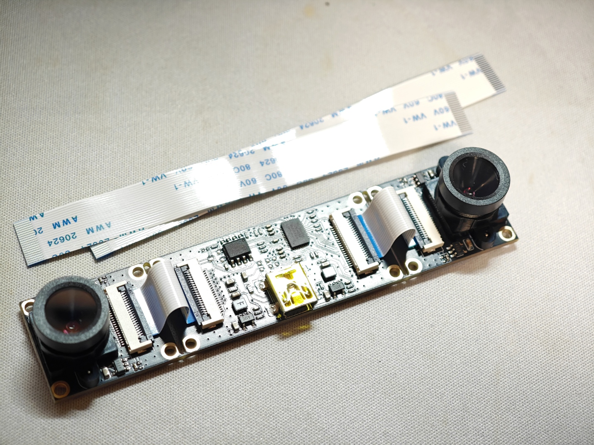
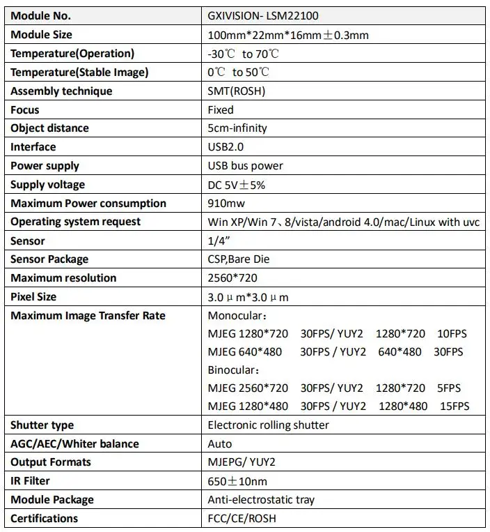
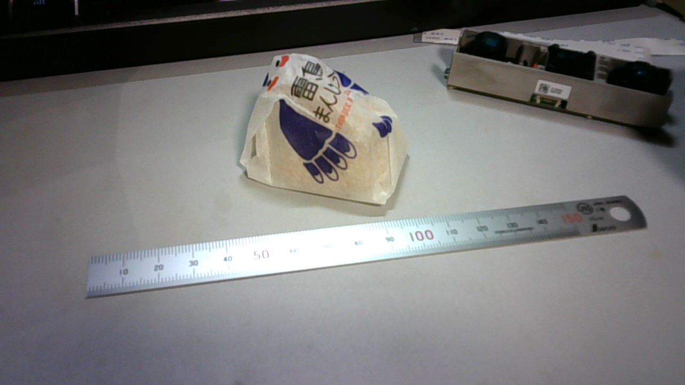
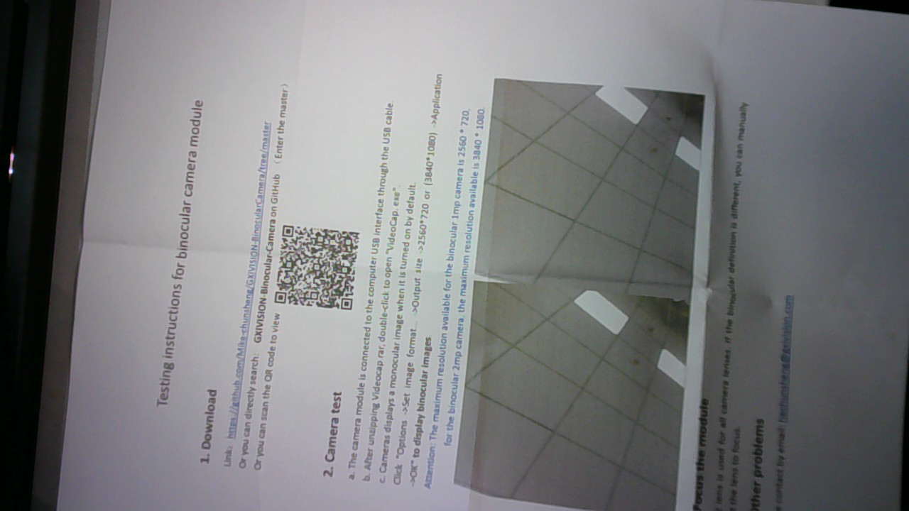
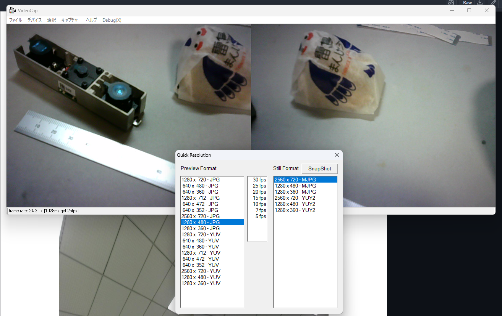
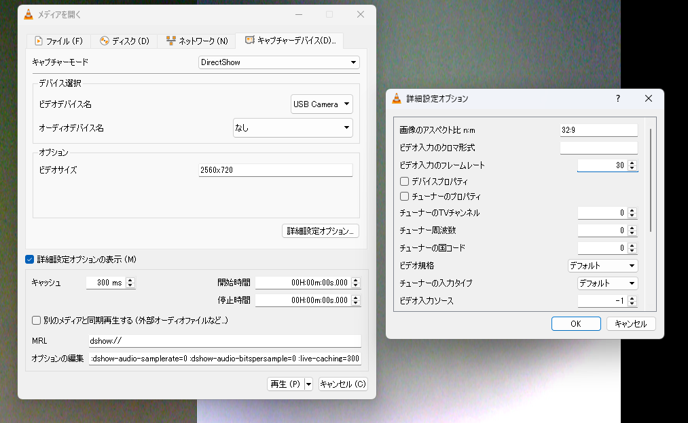
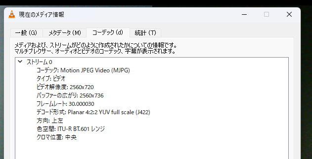
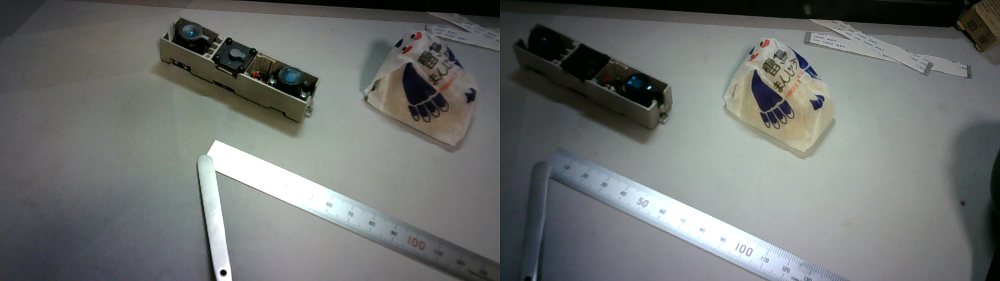
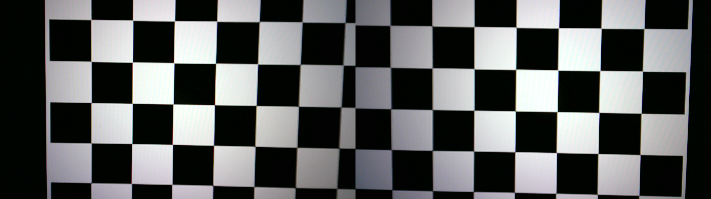
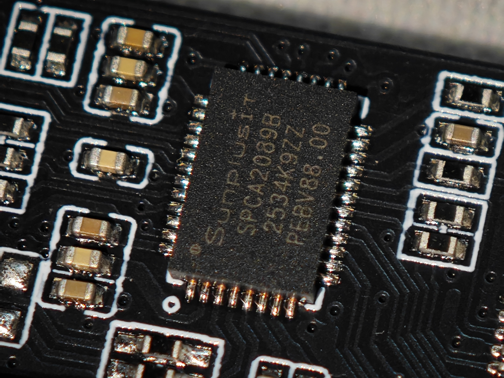

+++
title = '2眼カメラGXIVISION-LSM22100を触ってみる'
date = 2026-05-19T01:07:01+09:00
draft = false
categories = ['Projects']
tags = []
image = ''
description = ''
ogpImage = ''
+++

****
 
GXIVISION 3D ステレオ VR USB カメラモジュール 720P デュアルレンズ付き、2560x720 30fps、同期同じフレーム、ベースライン調整可能、Windows/Linux/Android 用 - ... https://ja.aliexpress.com/item/1005004587961991.html\
\

## スペック
- 1MPセンサ720p，静止解像度Max2560x720px
- MJEPG 2560x720@30fps; YUV 2560x720@5fps
- 同期シャッター
- デフォルト焦点距離4.2mm，カメラ間距離85mm
\

UVC純正だと左目だけの映像になる\
解像感はこんな感じ\
\
\

## セットアップ
Mike-chunsheng/GXIVISION-BinocularCamera at master https://github.com/Mike-chunsheng/GXIVISION-BinocularCamera/tree/master\
から`Videocap.zip`をダウンロード，解凍して`VideoCap.exe`を実行\
タブバーよりDebugを押すと解像度とフレームレートの選択ができるので2560x720を選択すると2画面合成になる\
\
けどなぜかMJPEGだと右目がおかしい\
\
こわE\
YUY2だとシャッター音鳴るけど撮られないし...\

### 大人しくVLCを使う
VLCでこの設定でキャプチャデバイスを開くとこんな感じ\
\
\
\
ちゃんと撮れてる\

\
リポジトリに付属の較正画像映してもこんな感じ，歪無いんあじゃない?\

このカメラ自体はただの同期シャッター式の二眼カメラだから，あとはOpenCVとかで煮るなり焼くなり何でも出来そう\
発熱もこいつがじんわりあったかくなる程度\
\