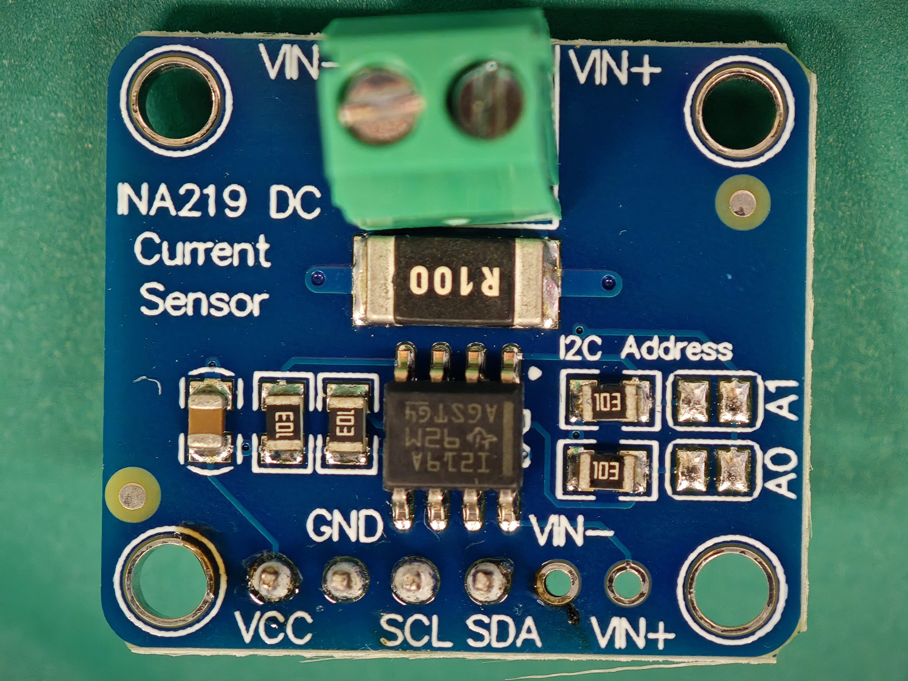
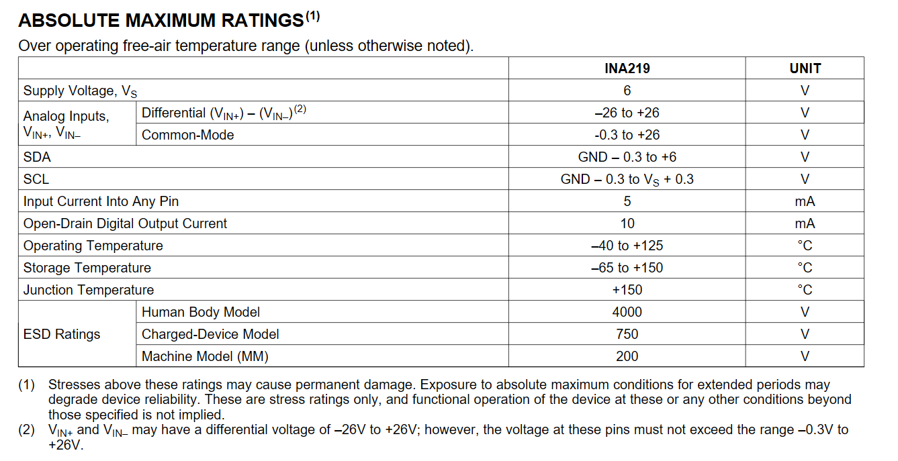
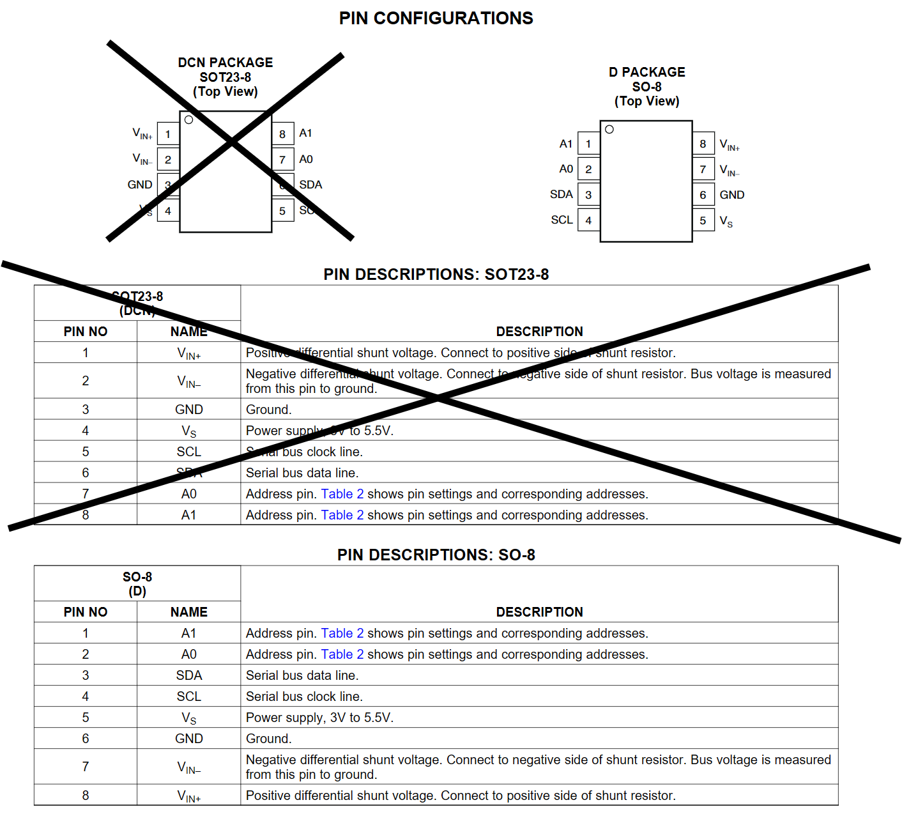
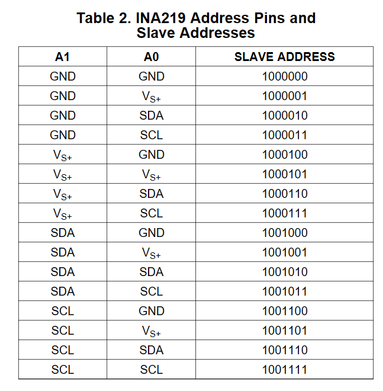

+++
title = 'INA219のI2Cモジュールを触る'
date = 2026-05-13T03:36:12+09:00
draft = false
categories = []
tags = []
image = ''
description = ''
ogpImage = ''
+++
\
INA219A\
SO-8 D\
VDD3.3/5Vnom\
\

\
\
A1,A0はGNDに10kでプルダウン、ジャンパはVDDとショート\
A0  A1   ADDR\
open open 0x80\
open close 0x88\
close open 0x81\
close close 0x89\