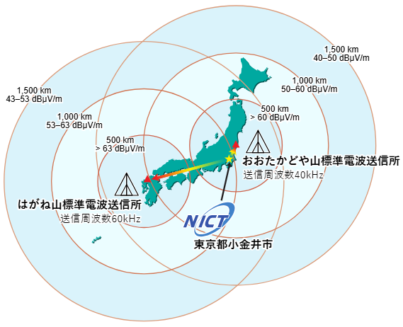

+++
title = 'JJY受信ラジオの作成'
date = 2026-05-19T01:07:24+09:00
draft = false
categories = ['Projects']
tags = []
image = ''
description = 'ここに記事の解説'
ogpImage = ''
+++
WIP\
## JJYとは
>標準電波（JJY※）は、NICTが決定した標準周波数と日本標準時を日本全国に供給するための電波です。
[https://www.nict.go.jp/sts/jjy.html]\

長波帯で発射している基準用時刻送信局であり、日本では西日本のはがね山標準電波送信所(60 kHz)と東日本のおおたかどや山標準電波送信所(40 kHz)の2局が存在します。\
\
標準電波の到達範囲[https://www.nict.go.jp/sts/jjy.html]\

電波時計はこのJJYを受信して時間を較正しています。\

## JJYの読み方
JJYは40 kHz/60 kHzを搬送周波数とするAM変調波です。信号波は1 HzのPWMのデジタル信号であり、パルス幅で\
	- パルス幅 0.8 s ±5 ms	2進の0
	- パルス幅 0.5 s ±5 ms	2進の1
	- パルス幅 0.2 s ±5 ms	ポジションマーカー (Ｍ, P0-P5）
の3値を符号化しています。\

1パケットは60秒60bit。\

記事途中\