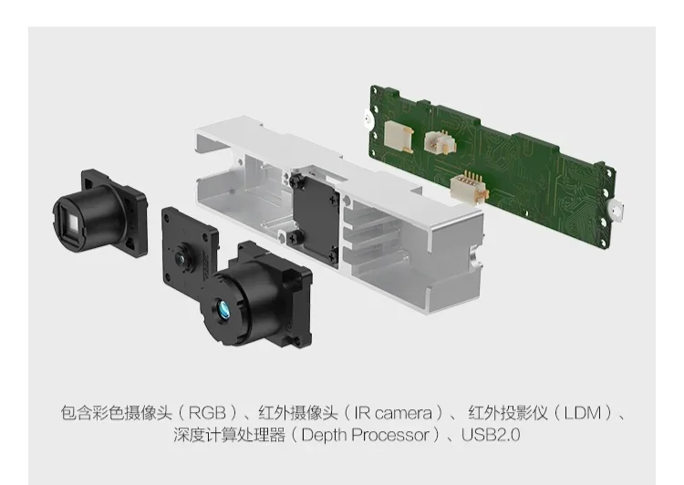
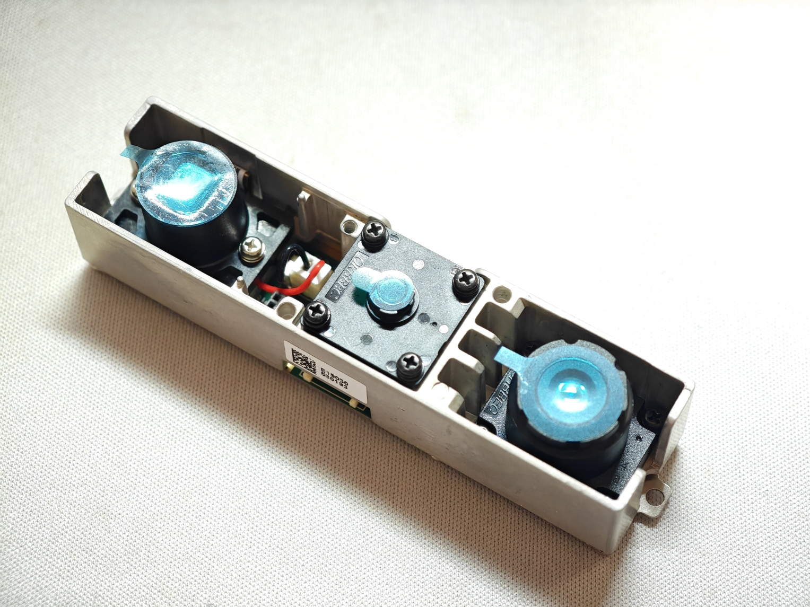

+++
title = 'Orbbec Astra Mini Sを触る'
date = 2026-05-19T01:07:17+09:00
draft = false
categories = ['Projects']
tags = []
image = ''
description = ''
ogpImage = ''
+++

 
Orbbec Astra Mini S 3D深度カメラ 0.4-2M 体性感覚カメラ 3Dスキャン 顔認識 ジェスチャーコントロールロボット用 - AliExpress 7 https://ja.aliexpress.com/item/1005010040021839.html\
https://store.orbbec.com/products/astra-mini-s (公式)\
https://www.unipos.net/products/orbbec-astra-mini/ (日本代理店)\
\
RGBセンサ，IRセンサ，LDMは赤外線投光器?\
0.4-2mの範囲で1m時精度±3mmらしい，\
RGB Image Res.: 640 x 480 @30fps\
Depth Image Res.: 640 x 480 @30fps\
Size: 80mm x 20mm x 20mm\

\
(レンズ保護用のシールが油ですごいベタベタしてる)\

PCに刺してみても認識されない，UVCとかで見れる類ではないらしい\
公式のSDKページはここ\
https://www.orbbec.com/developers/orbbec-sdk/\

windows向けにSDKとカメラドライバーの両方をダウンロードしておく\

記事途中\