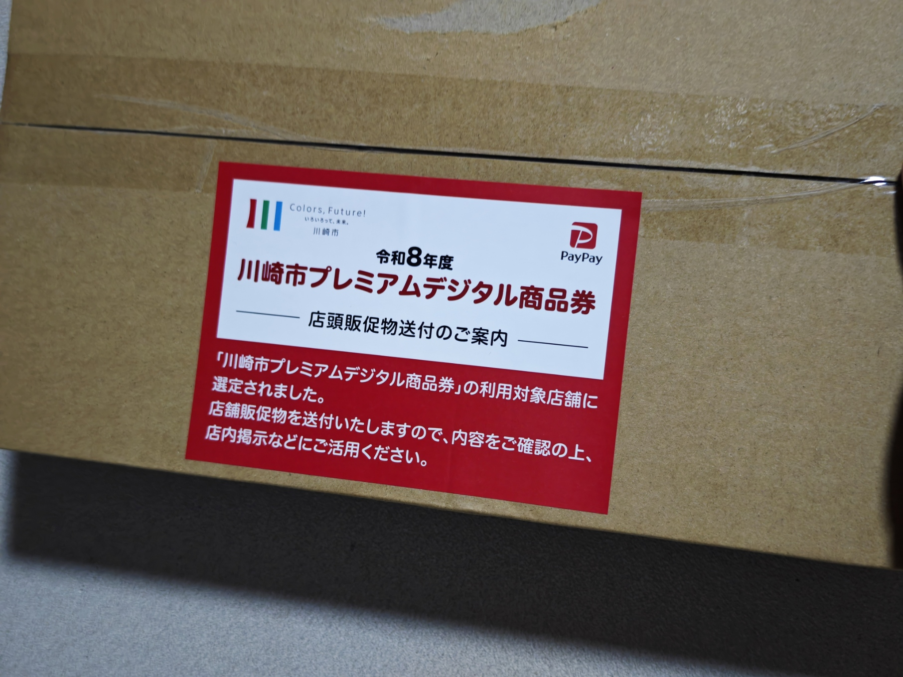
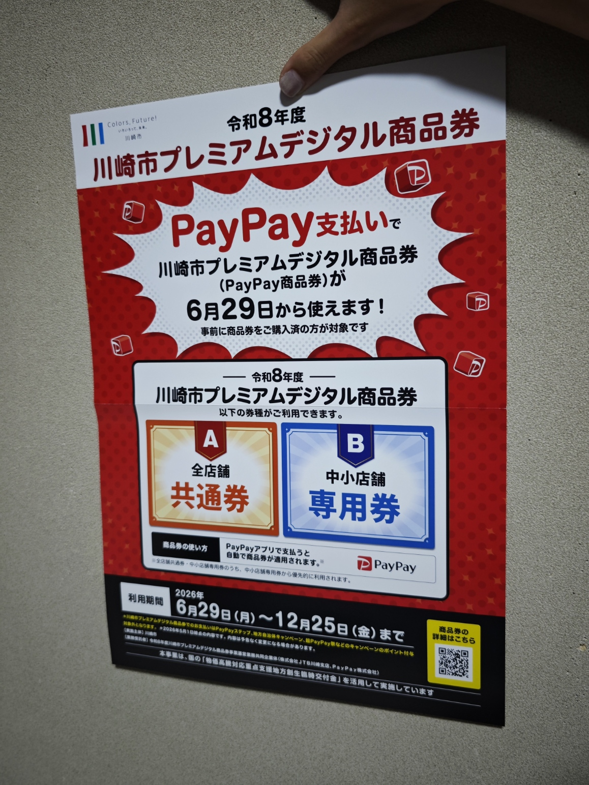
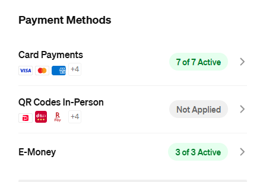
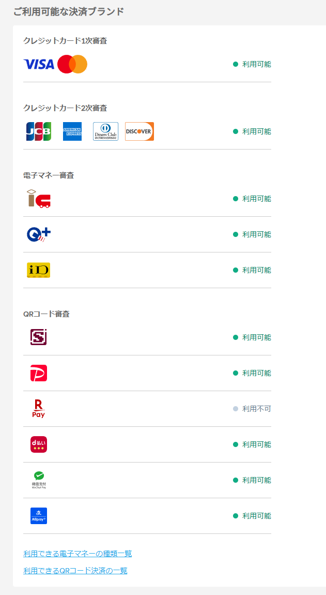

+++
title = 'ある日突然，川崎市プレミアムデジタル商品券の中小店舗に選ばれた'
date = 2026-07-03T17:09:29+09:00
draft = false
categories = ['daily']
tags = ['サークル']
image = ''
description = ''
ogpImage = ''
+++
ある日，ヤマトより私のサークル名義「ΔVラボ」宛にとある荷物が届きました．\
\

......?

確かに，私は年1か2回くらいのコミケにおいてサークル出展をするために，Squareによる電子決済を導入しています．登録情報も川崎市で登録しています．\
しかし実店舗が無い，移動式あるいはネットオンリーの店舗でも選ばれることがあるとは思わないじゃないですか．

これコミケ現地で掲示して使っても良いんですかね?

あともう一つ，私SquareではPayPay加盟店に登録していなかったんですよ．\

なのになんでかなーと思ったら，ノリで導入したSTORES決済，これの審査のときにどうやら各種QR決済もセットで行われていたようで有効になっていました．\

若干のめんどくささと変なことになっててどうしよう