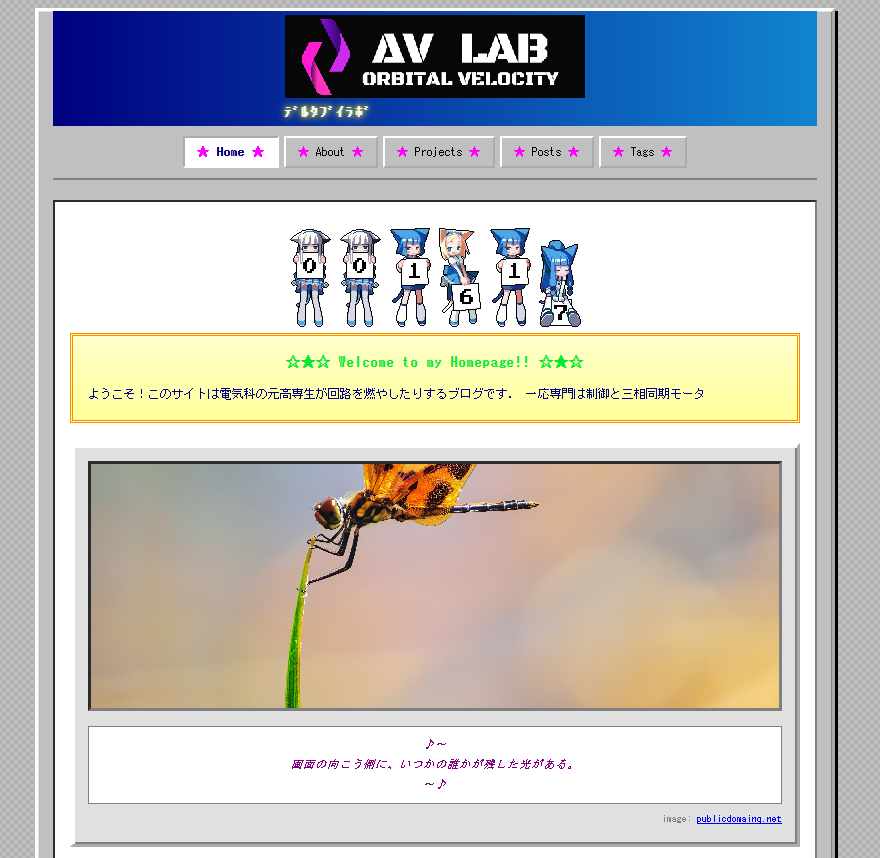
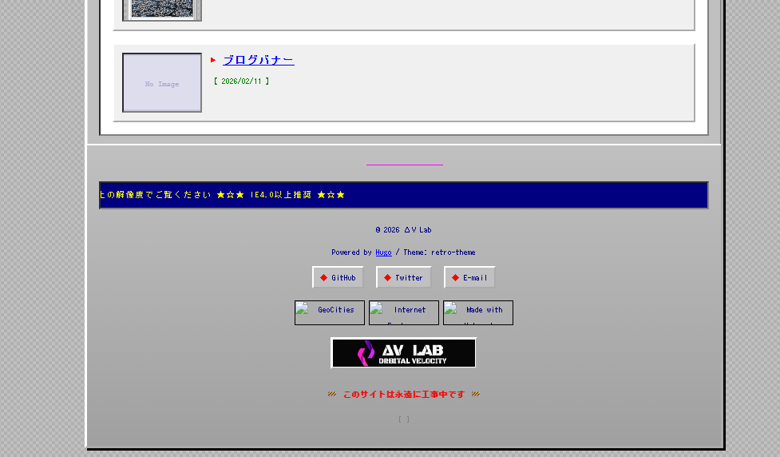

+++
title = 'Hugo+Cloudflare pagesを用いたレトロ個人ページの作成'
date = 2026-05-19T02:39:59+09:00
draft = false
categories = ['Projects']
tags = ['Cloudflare', 'Hugo']
image = ''
description = ''
ogpImage = ''
+++

 
\

\

このブログを作りました．\
フレームワークはHugoを用い，テーマは独自のレトロ個人ページを意識した雰囲気としています．\
古くシンプルな見た目とは裏腹に，\
- Cloudflare Pages
- Hugo
- Cloudflare D1
- Cloudflare Turnstile
- Google Analytics
- Open Graph
等多数のライブラリ等によって成り立っています．\
ダイアルアップ接続で読めそうなサイトですが転送量は14 MB，かなり重い\

こだわりポイントとして，静的ページ配信でアクセスカウンタ，いいね数，コメント欄の実装を行っているところです．またわざわざブログバナーまで作成しました．\
https://blog.deltav-lab.org/banner/\

↓かわいい\
https://x.com/rei_512_/status/2021942700996727128\

またHugoで記事を書くのに環境にかなり依存するのが面倒なので，Obsidian経由で簡単に書けるようにも整備してます．\
https://blog.deltav-lab.org/projects/obsidian%E3%82%92%E4%BB%8B%E3%81%97%E3%81%9F%E7%92%B0%E5%A2%83%E9%9D%9E%E4%BE%9D%E5%AD%98%E3%81%AE%E3%83%96%E3%83%AD%E3%82%B0%E5%9F%B7%E7%AD%86%E3%82%B7%E3%82%B9%E3%83%86%E3%83%A0%E3%81%AE%E6%A7%8B%E7%AF%89/\